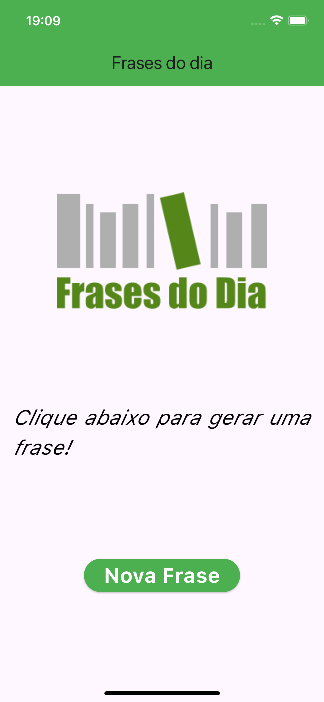
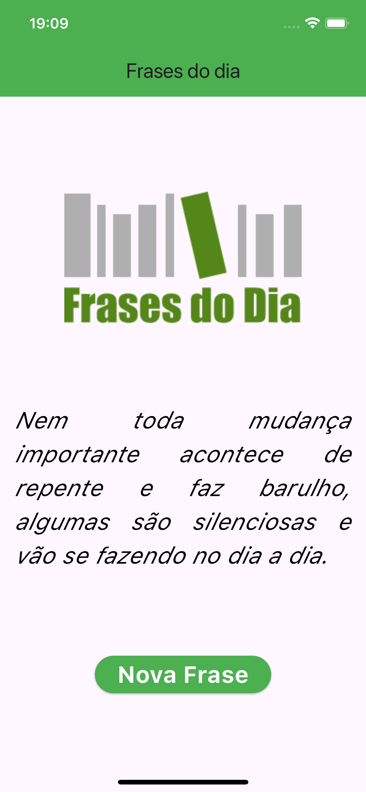

# App Frases do dia

## Descrição

Um aplicativo simples com uma lista de frases fixas, que é exibida aleatoriamente ao clicar no botão que foi desenvolvido durante o curso de Desenvolvimento Flutter Mobile.

## Curso

**Desenvolvimento Android e IOS com Flutter - Crie 15 Apps**

[Link para o curso na Udemy](https://www.udemy.com/course/desenvolvimento-android-e-ios-com-flutter/?couponCode=MCLARENT71824)

## Status do Projeto

- **Concluído:** 12/10/2021
- **Atualizado:** 30/07/2024

## Tecnologias Utilizadas


## Funcionalidades

- Tela dos inicial
- Atualizar frase

## Instalação

Siga os passos abaixo para rodar o projeto localmente:

1. Clone o repositório:
    ```sh
    git clone https://github.com/rafaelleonan/app-flutter-frases-do-dia.git
    ```
2. Navegue até o diretório do projeto:
    ```sh
    cd app-flutter-frases-do-dia
    ```
3. Instale as dependências:
    ```sh
    flutter pub get
    ```
4. Execute o aplicativo:
    ```sh
    flutter run
    ```

## Telas
<p>
  
  
</p>

## Video Demonstração
[Assista o vídeo](https://ucff38d77311aa338998d4923c32.dl.dropboxusercontent.com/cd/0/inline/CXxVPfYnfB6liQfmTgGxNsrV_X4FVAP8HT5pWWw75Opth5PQDqVgTxCgvNDaGdeqzy6ZonzeC-chDn8-ggGDKob8WVbj8TyjKbmixF8pZwki7WMWuz_MgLxpKIbYK73fxdEa5wiqB1oP7qj6U4mUMhxB/file#)
